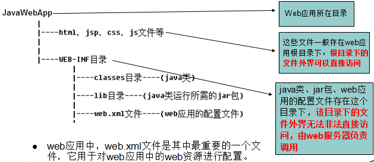
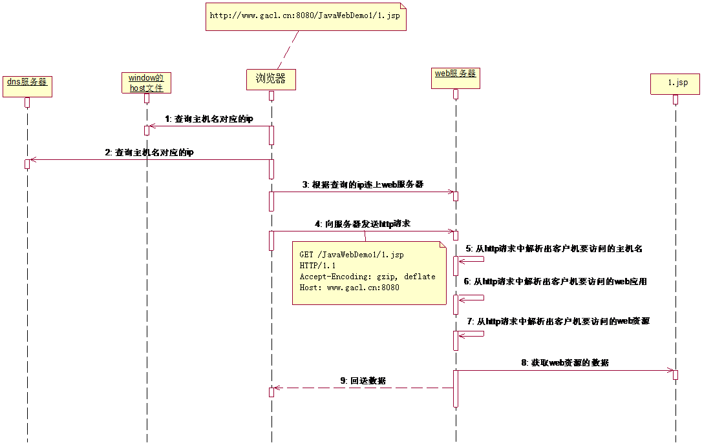
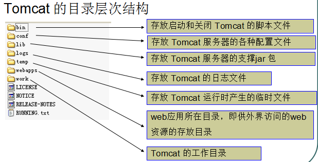
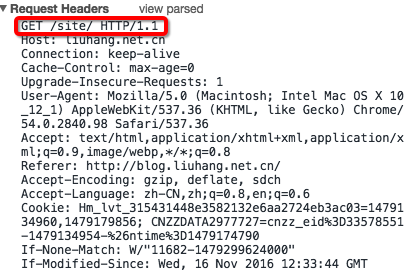
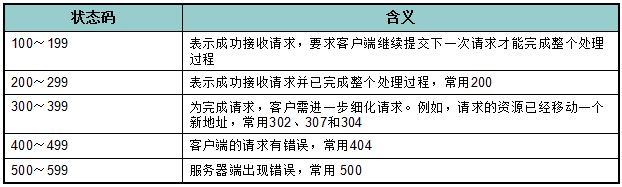
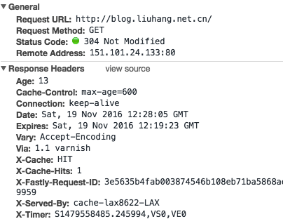

## Web容器、服务器的含义和区别
1. [Web容器,服务器理解](http://aoyouzi.iteye.com/blog/2028611)  博客推荐
2. 容器: 举例说明: Servlet没有main()方法。Servlet受控于另一个Java应用，这个Java应用称为容器.
    + [何谓容器](http://openhome.cc/Gossip/ServletJSP/Container.html) ,关于容器的详解
    + 在具体层面,容器实际上是Java应用程序,运行于JVM之上,不同类型的容器负责不同的工作，例如Servlet/JSP所运行的Web容器（Web Container),功能之一就是把JSP代码翻译成java代码
3. 服务器，硬件角度上说就是一台高性能的Computer。我们通常指的服务器其实应该是装有能够处理具体请求事务的服务器软件的Computer
4. Web服务器是指驻留于因特网上某种类型计算机的程序，是可以向发出请求的浏览器提供文档的程序。当Web浏览器（客户端）连到服务器上并请求文件时，服务器将处理该请求并将文件反馈到该浏览器上
5. Client-Server架构

- 动态WEB中，程序依然使用客户端和服务端，客户端依然使用浏览器（IE、FireFox等），通过网络(Network)连接到服务器上，使用HTTP协议发起请求（Request），现在的所有请求都先经过一个WEB Server Plugin（服务器插件）来处理，此插件用于区分是请求的是静态资源(*.htm或者是*.htm)还是动态资源。
- 如果WEB Server Plugin发现客户端请求的是静态资源(*.htm或者是*.htm)，则将请求直接转交给WEB服务器，之后WEB服务器从文件系统中取出内容，发送回客户端浏览器进行解析执行。
- 如果WEB Server Plugin发现客户端请求的是动态资源（*.jsp、*.asp/*.aspx、*.php），则先将请求转交给WEB Container(WEB容器)，在WEB Container中连接数据库，从数据库中取出数据等一系列操作后动态拼凑页面的展示内容，拼凑页面的展示内容后，把所有的展示内容交给WEB服务器，之后通过WEB服务器将内容发送回客户端浏览器进行解析执行。

##  Apache、Tomcat与Catalina作为软件名字的含义与关系
1. JavaWeb中常见这三个词,一直没闹清楚这三个词命名的来源和含义,找到一篇文章总结的不错.[文章戳这里](http://blog.csdn.net/yingchengsun/article/details/44340211)

## JavaWeb应用的组成结构

## 浏览器与服务器的交互过程
1. URL:统一资源定位符(即网址) uniform resources location
   URI:统一资源标识符, uniform resource identify
   http://localhost:8080/doc/1.html
   协议  主机IP(端口号)   URI(当前应用的资源路径)
2. 浏览器与服务器交互过程图
   

## Tomcat简介
1. Tomcat目录层次结构

**应学会查看logs日志信息来排查错误**

2. Tomcat体系结构

Tomcat服务器的启动是基于一个server.xml文件的，Tomcat启动的时候首先会启动一个Server，Server里面就会启动Service，Service里面就会启动多个"Connector(连接器)"，每一个连接器都在等待客户机的连接，当有用户使用浏览器去访问服务器上面的web资源时，首先是连接到Connector(连接器)，Connector(连接器)是不处理用户的请求的，而是将用户的请求交给一个Engine(引擎)去处理，Engine(引擎)接收到请求后就会解析用户想要访问的Host，然后将请求交给相应的Host，Host收到请求后就会解析出用户想要访问这个Host下面的哪一个Web应用,一个web应用对应一个Context。

## HTTP协议
1. hypertext transfer protocol（超文本传输协议）
2. HTTP请求
    - 一个完整的HTTP请求包括如下内容：一个请求行、若干消息头、以及实体内容
    
    - 第一行请求行 请求方式(get,post) URI  协议版本    
3. HTTP响应
	- 状态码
	
	- 一个HTTP响应代表服务器向客户端回送的数据，它包括： 一个状态行、若干消息头、以及实体内容 。
	

## 博客推荐
[JavaWeb开发入门-孤傲苍狼](http://www.cnblogs.com/xdp-gacl/p/3729033.html)   这篇博客非常值得好好学习一下!
